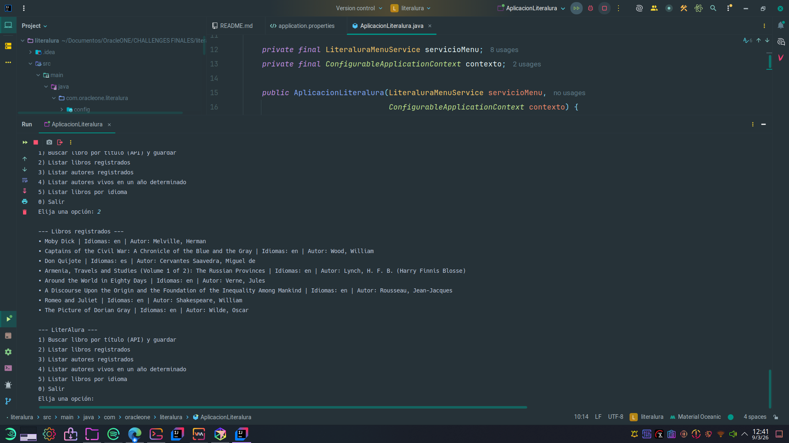

# LiterAlura

Desafío **Oracle ONE** – Catálogo de libros con interacción por **consola**, usando la API [Gutendex](https://gutendex.com/) (Project Gutenberg) y **Spring Boot**. El proyecto cumple con las pautas del Trello del challenge según el volcado `WDyMPDMb - literalura-challenge-java.json`.

**Objetivo:** ofrecer al menos 5 opciones de interacción (buscar/libros guardados, listar libros, listar autores, autores vivos en un año, libros por idioma), con datos persistidos en PostgreSQL.

## Requisitos

- **Java 17**
- **Maven 3.6+**
- **PostgreSQL** (host configurado mediante la variable de entorno `DB_HOST_POSTGRE`)

## Tecnologías

- Spring Boot 3.5.x, Java 17
- Spring Data JPA, Flyway, PostgreSQL

## Base de datos

Crear la base en PostgreSQL (en el servidor donde corre la BD). El usuario y la contraseña los toma la app desde las variables de entorno `DB_USER_SCREENMATCH` y `DB_PASSWORD_POSTGRE` (por ejemplo definidas en `~/.profile`).

```sql
CREATE DATABASE literalura;
-- Otorgar permisos al usuario que usará la app (el de DB_USER_SCREENMATCH)
GRANT ALL PRIVILEGES ON DATABASE literalura TO tu_usuario;
```

Las credenciales se configuran en `application.properties` mediante `${DB_USER_SCREENMATCH}` y `${DB_PASSWORD_POSTGRE}`. El esquema se crea con **Flyway** en `src/main/resources/db/migration` (formato `V{número}__{descripción}.sql`).

## Configuración de variables de entorno

La aplicación toma la configuración sensible desde variables de entorno. Las principales son:

- `DB_HOST_POSTGRE`: host de PostgreSQL (por ejemplo `localhost` o la IP/hostname del servidor).
- `DB_USER_SCREENMATCH`: usuario de la base de datos `literalura`.
- `DB_PASSWORD_POSTGRE`: contraseña del usuario de la base de datos.
- `APP_API_GUTENDEX_URL` (opcional): URL base de la API Gutendex. Por defecto se usa `https://gutendex.com/books` definida en `application.properties` (`app.api.gutendex.url`).

Ejemplos de configuración:

- **Linux / macOS (bash/zsh)**  
  Añadir en `~/.bashrc`, `~/.zshrc` o similar:

  ```bash
  export DB_HOST_POSTGRE=localhost   # o la IP/hostname de tu servidor PostgreSQL
  export DB_USER_SCREENMATCH=tu_usuario
  export DB_PASSWORD_POSTGRE=tu_password
  # Opcional, sólo si querés sobreescribir la URL por defecto
  # export APP_API_GUTENDEX_URL=https://gutendex.com/books
  ```

  Luego recargar la shell:

  ```bash
  source ~/.bashrc   # o ~/.zshrc
  ```

- **Windows (PowerShell)**  

  ```powershell
  [Environment]::SetEnvironmentVariable("DB_HOST_POSTGRE", "localhost" o "IP", "User")
  [Environment]::SetEnvironmentVariable("DB_USER_SCREENMATCH", "tu_usuario", "User")
  [Environment]::SetEnvironmentVariable("DB_PASSWORD_POSTGRE", "tu_password", "User")
  # Opcional:
  # [Environment]::SetEnvironmentVariable("APP_API_GUTENDEX_URL", "https://gutendex.com/books", "User")
  ```

Tras configurar las variables, verificar que están visibles en la terminal (por ejemplo `echo $DB_HOST_POSTGRE` en Linux/macOS o `echo $Env:DB_HOST_POSTGRE` en PowerShell).

## Cómo ejecutar

```bash
./mvnw spring-boot:run
```

O con Maven instalado:

```bash
mvn spring-boot:run
```

## Opciones del menú (consola)

1. Buscar libro por título (API) y guardar  
2. Listar libros registrados  
3. Listar autores registrados  
4. Listar autores vivos en un año determinado  
5. Listar libros por idioma (muestra cantidad y listado)  
0. Salir  

## Captura de pantalla

```markdown

```

## Licencia

Uso educativo – Oracle ONE / Alura.
